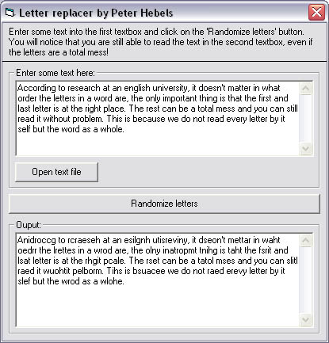



## Letter Replacer \(Update 2\)

### Description

According to research at an english university, it doesn't matter in what order the letters in a word are, the only important thing is that the first and last letter is at the right place. The rest can be a total mess and you can still read it without problem. This is because we do not read every letter by it self but the word as a whole.

This 'never seen before' code can make such words for you, it saves the first and last letter and makes a 'total mess' of the middle ones!

Update includes: Now the program is faster and the code is easier to read, this because it is more compact now.

Thanks to Roger Gilchrist for sending me this optimalizations! (NOTE: there is a project like this submitted a while after I submitted mine. That code is not a rip, it works totaly diffrent then this one does)
 
### More Info
 

             |
---                |---
**Submitted On**   |2003-09-23 18:38:42
**By**             |[Peter Hebels](https://github.com/Planet-Source-Code/PSCIndex/blob/master/ByAuthor/peter-hebels.md)
**Level**          |Advanced
**User Rating**    |5.0 (15 globes from 3 users)
**Compatibility**  |VB 5\.0, VB 6\.0
**Category**       |[String Manipulation](https://github.com/Planet-Source-Code/PSCIndex/blob/master/ByCategory/string-manipulation__1-5.md)
**World**          |[Visual Basic](https://github.com/Planet-Source-Code/PSCIndex/blob/master/ByWorld/visual-basic.md)
**Archive File**   |[Letter\_Rep1649229232003\.zip](https://github.com/Planet-Source-Code/peter-hebels-letter-replacer-update-2__1-48659/archive/master.zip)

